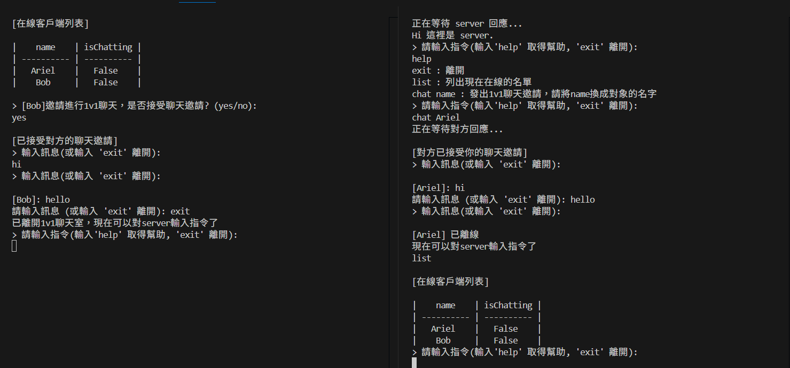
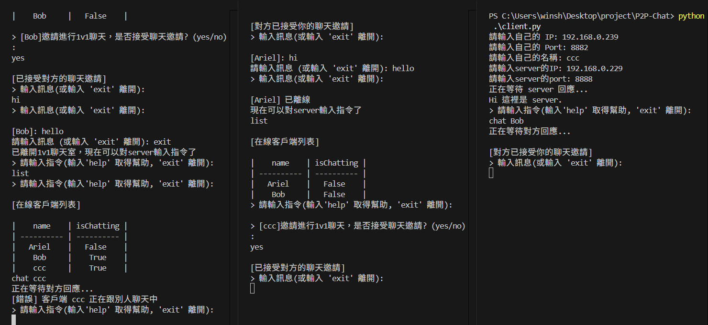
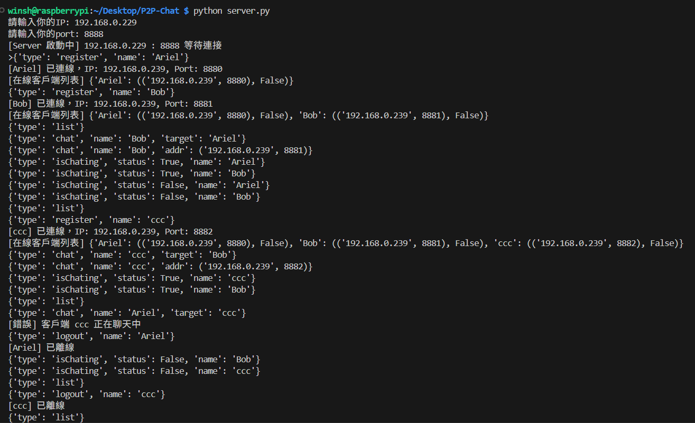

P2P-Chat
===
一個基於 UDP 協定的點對點聊天系統  
用戶可以連線到中央 server 註冊名稱，查詢在線名單，並向其他用戶發起 1 對 1 聊天。

Prerequisite
---
Python 3.13.5

How to Use
===
### Server 端（建議用 Raspberry Pi 執行）
```bash
python server.py
```

### Client 端（任意電腦皆可）
```
python client.py
```
依序輸入：

自己的區網 IP（例：192.168.0.123）

自己的 Port（例：12345）

自己的暱稱（例：Alice）

常用指令（在 client 中輸入）
list：查詢目前在線的使用者
```
|    name    | isChatting |
| ---------- | ---------- |
|    Ariel   |    True    |
|    Bob     |    True    |
|    ccc     |    False   |
```

chat [名稱]：對指定使用者發送聊天邀請  
```
chat Ariel
```

exit：登出或離開聊天室


示範
===
右邊的client向左邊的client發起邀請，左邊的client答應了


---
中間的client跟右邊的client在聊天，左邊的client向右邊的client發起邀請就被server拒絕了


---
server紀錄了每個client的動作


---

心得
===
為了實現這個專案，我學習了很多網路原理的基本知識。  
例如：`TCP/UDP`、`ssh加密`、`json格式`  
也用到了新的 python 模組：`socket`、`threading`  
能更理解這個每天都在用的網路世界讓我覺得很有趣